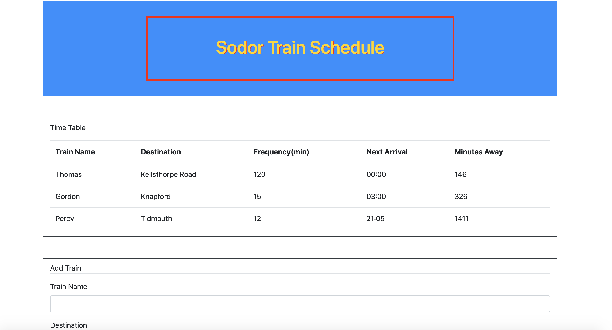

# Train-Scheduler

## What I was supposed to be doing:
I was supposed to replicate the train scheduler shown in class

## Tools Used:
HTML
CSS/Bootstrap
Javascript/JQuery/Moment.js
Firebase

## How I did it:
After building out my HTML Document, I configured firebase and set empty variables to be used later. I then used a click listener that pushed the values a user input into the input bars to Firebase. Then, whenever Firebase was updated, I used JQuery to append new rows to the table, each one containing a column with a value corresponding to the inputs. For the time until next departure value, I used moment.js to calculate the difference between now and when the train is scheduled for. After that I added some styling to make my page nice and Thomas the Tank Engine-y

## Problems I encountered
When using moment.js I had a some trouble getting the formatting syntax right, and even after that, I couldn't get the time differences working 100% properly. Luckily I found a brute force solution to my problem, but I know it wasn't the ideal way of going about things.
